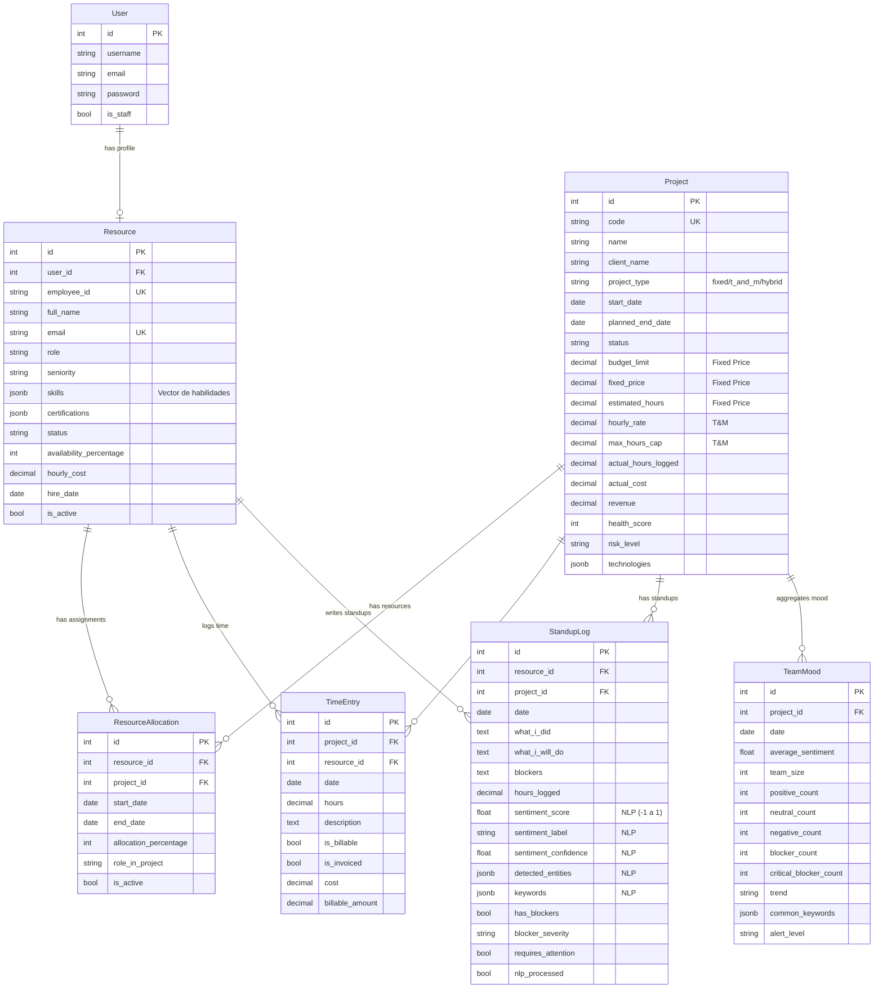

# Arquitectura de Modelos de Datos - SIGRP

## 📊 Diagrama Entidad-Relación



## 🔑 Conceptos Clave por Modelo

### 1. **Resource** - Recurso Humano

**Propósito**: Representa a los profesionales disponibles para asignación.

**Campos Destacados**:
- `skills` (JSONB): Vector de habilidades con nivel 1-5
  ```json
  {
    "python": 5,
    "django": 4,
    "react": 3,
    "aws": 4,
    "docker": 3
  }
  ```
- `availability_percentage`: % de tiempo disponible (0-100)
- `hourly_cost`: Costo interno por hora para cálculos

**Métodos Clave**:
- `get_skill_level(skill_name)`: Obtiene nivel de una habilidad
- `is_available_for_project(required_percentage)`: Verifica disponibilidad
- `calculate_project_cost(hours)`: Calcula costo total

---

### 2. **Project** - Proyecto

**Propósito**: Gestión de proyectos con dos modalidades: Fixed Price y Time & Material.

**Modalidades**:

#### **Fixed Price (Precio Fijo)**
- `fixed_price`: Precio acordado con el cliente
- `budget_limit`: Límite interno del presupuesto
- `estimated_hours`: Estimación interna de horas

**Riesgo**: Cuando `actual_cost > budget_limit` → Proyecto en pérdidas

#### **Time & Material**
- `hourly_rate`: Tarifa por hora cobrada al cliente
- `max_hours_cap`: Límite opcional de horas facturables

**Facturación**: `revenue = actual_hours * hourly_rate`

**Métodos Clave**:
- `get_budget_consumption_percentage()`: % de consumo del presupuesto
- `get_profitability()`: Profit = Revenue - Cost
- `is_over_budget()`: Verifica si excede presupuesto (Fixed)
- `calculate_completion_percentage()`: % de avance del proyecto

---

### 3. **TimeEntry** - Registro de Tiempo

**Propósito**: Tracking de horas trabajadas (fundamental para ambos tipos de proyecto).

**Flujo**:
1. Recurso registra horas en un proyecto
2. Se calcula `cost = resource.hourly_cost × hours`
3. Para T&M: `billable_amount = project.hourly_rate × hours`
4. Se actualiza `project.actual_hours_logged` y `project.actual_cost`

**Campos**:
- `is_billable`: Si se factura al cliente
- `is_invoiced`: Si ya fue facturado

---

### 4. **StandupLog** - Daily Standup con NLP

**Propósito**: Captura standups diarios y analiza sentimiento automáticamente.

**Preguntas Capturadas**:
1. ¿Qué hice ayer? → `what_i_did`
2. ¿Qué haré hoy? → `what_i_will_do`
3. Bloqueadores → `blockers`

**Análisis NLP (Celery Task)**:
- `sentiment_score`: -1 (muy negativo) a +1 (muy positivo)
- `sentiment_label`: positive | neutral | negative | very_negative
- `detected_entities`: Términos técnicos extraídos
- `keywords`: Keywords principales

**Flags de Riesgo**:
- `requires_attention = True` si:
  - Sentimiento muy negativo
  - Bloqueadores críticos

---

### 5. **TeamMood** - Agregación de Sentimiento del Equipo

**Propósito**: Analiza el mood colectivo del equipo por proyecto/día.

**Generación**: Celery task que agrega múltiples `StandupLog` del mismo proyecto/fecha.

**Métricas**:
- `average_sentiment`: Promedio de sentiment_score
- `positive_count`, `neutral_count`, `negative_count`: Distribución
- `blocker_count`: Total de bloqueadores reportados
- `alert_level`: green | yellow | red

**Uso**: Dashboard para detectar early warnings de problemas en equipos.

---

## 🔗 Relaciones Principales

### Recurso → Proyecto
```
Resource ─┬→ ResourceAllocation ─→ Project
          └→ TimeEntry ─→ Project
```

**Caso de Uso**: Un recurso puede estar asignado a múltiples proyectos simultáneamente con diferentes `allocation_percentage`.

### Proyecto → Análisis NLP
```
Project ─→ StandupLog ─→ NLP Analysis ─→ TeamMood
```

**Flujo**:
1. Recursos escriben standups diarios
2. Celery procesa con spaCy
3. Se agrega en TeamMood por fecha

---

## 💡 Casos de Uso de Negocio

### 1. **Matching de Recursos a Proyectos**
```python
# Buscar recursos con Python nivel 4+ disponibles al 50%
resources = Resource.objects.filter(
    skills__python__gte=4,
    availability_percentage__gte=50,
    status='available'
)
```

### 2. **Alertas de Presupuesto (Fixed Price)**
```python
# Proyectos consumiendo > 90% del presupuesto
risky = Project.objects.filter(
    project_type='fixed'
).annotate(
    consumption=F('actual_cost') / F('budget_limit') * 100
).filter(consumption__gt=90)
```

### 3. **Detección de Problemas en Equipos**
```python
# Equipos con sentimiento negativo consistente
bad_mood = TeamMood.objects.filter(
    alert_level='red',
    date__gte=timezone.now() - timedelta(days=7)
).values('project').annotate(
    bad_days=Count('id')
).filter(bad_days__gte=3)
```

### 4. **Reporte de Rentabilidad**
```python
# Rentabilidad de proyectos Fixed Price
for project in Project.objects.filter(project_type='fixed', status='active'):
    profit = project.get_profitability()
    margin = project.get_profit_margin_percentage()
    print(f"{project.name}: ${profit} ({margin:.1f}% margin)")
```

---

## 🎯 Índices y Optimizaciones

**Índices Creados**:
- `Resource`: `(status, availability_percentage)` → Búsqueda de disponibles
- `Project`: `(status, is_active)` → Filtrado de activos
- `StandupLog`: `(resource, date)`, `(project, date)` → Queries temporales
- `TimeEntry`: `(project, date)`, `(is_billable, is_invoiced)` → Facturación

**Constraints**:
- `StandupLog`: Unique constraint en `(resource, project, date)` → Un standup por recurso/proyecto/día
- `ResourceAllocation`: Check `end_date >= start_date`

---

## 📈 Campos Calculados vs Almacenados

**Almacenados (denormalizados)**:
- `Project.actual_hours_logged` → Suma de TimeEntry.hours
- `Project.actual_cost` → Suma de TimeEntry.cost
- `Project.health_score` → Calculado por Celery task diaria

**Calculados en tiempo real**:
- `get_budget_consumption_percentage()`
- `get_profitability()`
- `calculate_completion_percentage()`

**Razón**: Performance en dashboards vs precisión en métodos.

---

## 🔄 Tareas Celery Relacionadas

1. **`calculate_project_health_scores`** (Diario 8 AM)
   - Actualiza `health_score` y `risk_level` de proyectos activos

2. **`analyze_recent_standups`** (Diario 6 PM)
   - Procesa standups sin NLP del día

3. **`calculate_team_mood`** (Por demanda)
   - Agrega sentimiento de equipo por proyecto/fecha

4. **`update_project_metrics`** (Diario)
   - Sincroniza `actual_hours_logged` y `actual_cost`

5. **`predict_resource_availability`** (Lunes 9 AM)
   - ML para predecir disponibilidad futura (TODO)

---

## 🚀 Extensiones Futuras

1. **Resource Skills Matching con ML**: Vector similarity usando embeddings
2. **Project Risk Prediction**: ML para predecir riesgo de overrun
3. **Resource Allocation Optimizer**: Algoritmo de asignación óptima
4. **Advanced NLP**: Detección de burnout, toxicidad, burnout patterns
5. **Time Series Forecasting**: Predicción de horas necesarias
