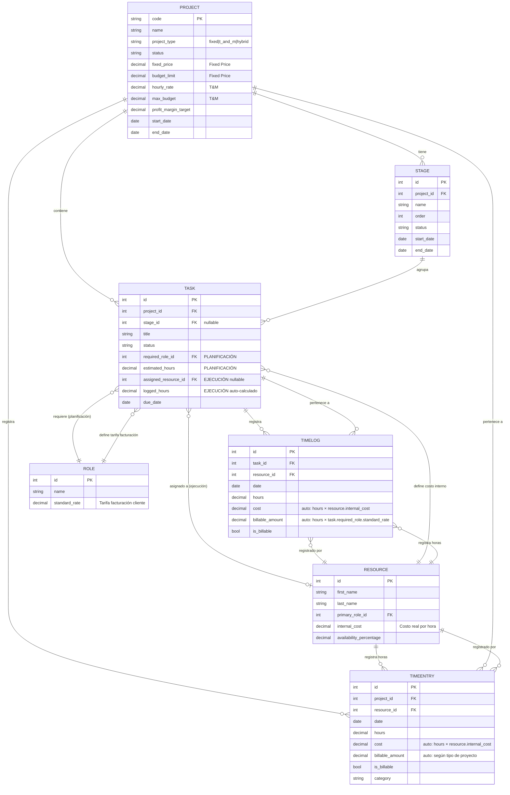

# Diagrama de Arquitectura del Módulo Projects

## Estructura Financiera Dual: Planificado vs Real



## Lógica Financiera Dual

### PLANIFICACIÓN (Basado en Rol)
```
Task.planned_value = Task.estimated_hours × Task.required_role.standard_rate
```
**Esto es lo que SE FACTURARÁ al cliente.**

### EJECUCIÓN (Basado en Recurso)
```
Task.actual_cost_projection = Task.logged_hours × Task.assigned_resource.internal_cost
```
**Esto es lo que CUESTA internamente.**

### Variaciones
```
Task.cost_variance = actual_cost_projection - planned_value
Task.hours_variance = logged_hours - estimated_hours
```

## Tipos de Proyecto

### Fixed Price
- `fixed_price`: Precio acordado con el cliente
- `budget_limit`: Presupuesto interno máximo
- **Riesgo**: Proveedor (si excedemos horas, perdemos dinero)

### Time & Materials
- `hourly_rate`: Tarifa por hora al cliente
- `max_budget`: Presupuesto máximo estimado
- **Riesgo**: Cliente (paga por todas las horas trabajadas)

### Hybrid
- Combina elementos de ambos
- Configuración flexible según necesidades

## Signals Automáticos

### update_task_logged_hours (post_save, post_delete en TimeLog)
```python
Task.logged_hours = SUM(TimeLog.hours WHERE task_id = Task.id)
```
Se ejecuta automáticamente cuando:
- Se crea un TimeLog
- Se modifica un TimeLog
- Se elimina un TimeLog

## Métricas Calculadas (@property)

### Project
- `total_logged_hours`: Suma de horas en TimeLog + TimeEntry
- `total_cost`: Suma de costos internos reales
- `total_billable`: Suma de montos facturables al cliente
- `profit_margin`: `((total_billable - total_cost) / total_billable) × 100`
- `is_over_budget`: Compara `total_cost` vs `budget_limit` o `max_budget`
- `completion_percentage`: Porcentaje de tareas completadas

### Stage
- `total_logged_hours`: Suma de horas en tareas de la etapa
- `total_planned_hours`: Suma de horas estimadas
- `actual_cost`: Suma de `actual_cost_projection` de tareas
- `planned_value`: Suma de `planned_value` de tareas
- `progress_percentage`: `(logged_hours / planned_hours) × 100`

### Task
- `planned_value`: `estimated_hours × required_role.standard_rate`
- `actual_cost_projection`: `logged_hours × assigned_resource.internal_cost`
- `cost_variance`: `actual_cost - planned_value`
- `hours_variance`: `logged_hours - estimated_hours`
- `is_over_budget`: `actual_cost > planned_value`
- `completion_percentage`: `(logged_hours / estimated_hours) × 100` (max 100%)
- `remaining_hours`: `estimated_hours - logged_hours` (min 0)

## Flujo de Trabajo Típico

1. **Crear Proyecto**
   - Definir tipo: Fixed Price o T&M
   - Configurar precios y presupuestos
   
2. **Crear Etapas** (opcional)
   - Dividir proyecto en fases lógicas
   - Definir orden de ejecución

3. **Crear Tareas**
   - Definir `required_role` (determina facturación)
   - Estimar `estimated_hours`
   - Asignar `assigned_resource` (determina costo)
   
4. **Registrar Tiempo**
   - `TimeLog`: Horas en tareas específicas
   - `TimeEntry`: Horas generales del proyecto
   
5. **Monitorear**
   - Revisar métricas calculadas
   - Identificar desviaciones
   - Ajustar planificación

## Ejemplo Numérico

### Tarea: "Implementar Login"
- `required_role`: Senior Developer (standard_rate = $150/h)
- `estimated_hours`: 8h
- `assigned_resource`: Juan Pérez (internal_cost = $80/h)

#### Planificación
```
planned_value = 8h × $150/h = $1,200 (lo que facturaremos)
```

#### Después de 10 horas trabajadas
```
logged_hours = 10h (actualizado automáticamente por signals)
actual_cost_projection = 10h × $80/h = $800 (lo que costó)

cost_variance = $800 - $1,200 = -$400 (ganancia extra!)
hours_variance = 10h - 8h = 2h (nos pasamos 2 horas)
```

**Análisis**: Aunque nos pasamos 2 horas, seguimos con ganancia porque el costo interno de Juan es bajo comparado con la tarifa que facturamos.
